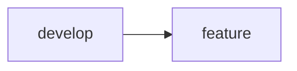
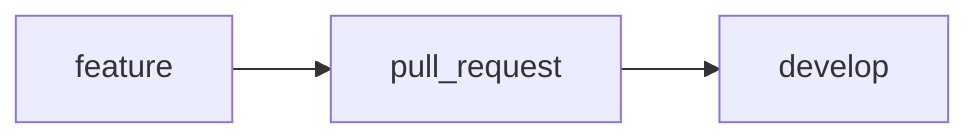
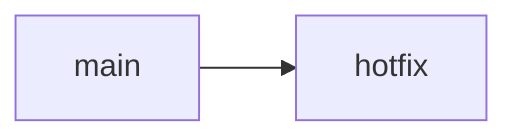
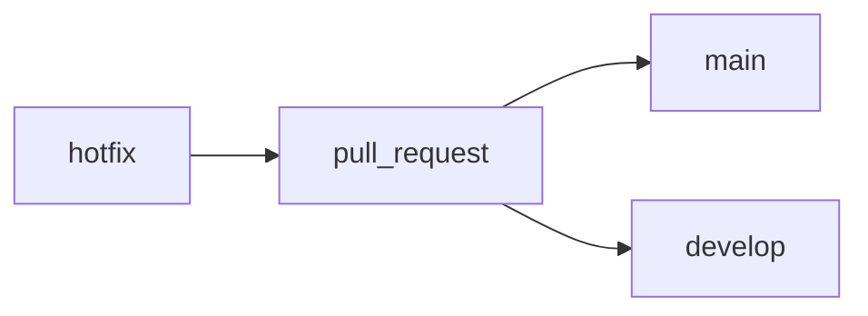

# Git

Esse é um guia de boas práticas e organização dos repositórios desse projeto.

## Apresentação do Repositório

Cada repositório contém 2 branchs pré definidas, sendo elas:

### Main

Nossa branch principal, que será utilizada para gerar as versões do nosso projeto e serem publicadas para o mundo.

#### Cuidados

- Nenhum desenvolvedor deve iniciar atividade a partir da Main. Quando for iniciar uma atividade, tome cuidado de realizar isso a partir da Develop;
- Por ser a nossa branch de referência para o mundo, em circusntância nenhuma ela pode conter atividades inacabadas ou com pendências;
- Não pode conter erros de nenhuma espécie e caso seja encontrado quaisquer falha, deve ser dado prioridade para a resolução do problema.

### Develop

Nossa branch secundária, espelho da Main, que deve ser usada de referência para as atividade a serem desenvolvidas.

É a partir dela também que publicaremos as novas atividades para a Main.

Tudo que for feito pelos desenvolvedores, para primeiro aqui e posteriormente é versionado para ser integrado a Main e publicado para o mundo.

#### Cuidados

- Como é a partir dessa branch que geramos as versões para a Main, assim como na Main, não podemos ter atividades inacabadas, com pendências ou erros, por isso é muito importante que antes de uma atividade ser integrada a Develop, sejam feitos testes e retestes para confirmar que está tudo funcionando.

## Git-Flow

Como boas práticas utilizamos do Git-Flow para melhorar o entendimento do fluxo de trabalho.

Essa boa prática nos ajuda a evitar sobreposição de atividades uma vez que todos os desenvolvedores trabalham em suas próprias branches e precisam se atualizar com a develop antes se integrarem suas atividades como veremos mais a frente.

## Branches

Como comentado antes, os desenvolvedores trabalham a partir da Develop, então cada atividade a ser realizada, devemos gerar uma branch nova a partir da develop usando o comando abaixo:

Comando para a criação de uma branch:
> git checkout -b nome-da-branch

O nome da branch é definido a partir do tipo de atividade que voce irá realizar, onde adotamos como prefixo do nome o tipo de atividade e depois o nome da atividade, exemplo:
> feature/form_create_user

### Prefixos

O Git-Flow pré determina quais serão os prefixos para cada tipo de atividade.

#### Feature

Utilizado para criação de novas funcionalidades, por exemplo, se voce vai iniciar uma nova atividade, onde a mesma pede para que voce crie um novo formulário para cadastro de usuários, um exemplo de branch seria:
> feature/form_create_user

Então antes de iniciar uma funcionalidade nova certifique-se que:

- Voce esta na branch develop
Comando para checar a branch:

> git branch

- Sua branch develop está atualizada, faça um pull:

> git pull

Se estiver tudo ok, criaremos a nossa nova feature:
> git checkout -b feature/form_create_user

Se voce checar sua branch agora com o comando:
> git branch

O resultado esperado é:
> feature/form_create_user

#### Bugfix

Utilizado para atividades de correção de problemas que não afetam o funcionamento geral do sistema ou sem urgência.

Assim como na feature, certifique-se:

- Voce esta na branch develop
Comando para checar a branch:

> git branch

- Sua branch develop está atualizada, faça um pull:

> git pull

E a criação também é pelo comando git checkout:
> git checkout -b bugfix/nome-da-branch

E para checar se ocorreu tudo bem:
> git branch

Resultado:
> bugfix/nome-da-branch

#### Hotfix

Esse prefixo é parecido com o Bugfix, serve também para correções, porém correções diretamente na Main, são para casos de extrema urgência.

Supondo que ocorreu um erro em produção em que o sistema parou ou uma determinada funcionalidade não consegue ser executada devido a algum bug.

Uma hotfix é criada para a solução desse problema.

> Esse é o único caso em que uma branch será inicializada a partir da main.

Então, certifique-se:

- Voce está na main

> git branch

- Sua branch main está atualizada, faça um pull:

> git pull

E a criação também é pelo comando git checkout:
> git checkout -b hotfix/nome-da-branch

E para checar se ocorreu tudo bem:
> git branch

Resultado:
> hotfix/nome-da-branch

### Fluxo de trabalho

Aqui explico como funcionará o fluxo de trabalho para cada prefixo mencionado antes.

#### Feature / Bugfix

##### Início

Como mencionado criaremos a feature a partir da develop

> Detalhe importante aqui, é ao criarmos uma branch nova, independente do prefixo, ela fica alocada apenas na sua máquina, então conforme for trabalhando, tem que realizar commits e fazer um push pra origin do git

Exemplo:
Voce criou sua branch, fez as primeiras alterações e não quer correr o risco de perdê-las. Vamos fazer um commit e um push para a origin para que fique salvo.

Prepara suas alterações:
> git add .

Informa a mensagem sobre o que voce realizou até o momento:
> git commit -m "mensagem sobre a atividade realizada"

E enviar para a origin do git:
> git push origin feature/nome_da_sua_branch

##### Fim

Ao terminar sua atividade, faça a seguinte checagem:

- Atividade testada
- Nenhuma Pendência
- Branch atualizada com a develop
- Branch encaminhada pra origin

> Outro detalhe, assim como voce, seus colegas também estão codificando, então há possibilidade de alguém enviar uma atividade antes da sua e por algum motivo seu colega ter alterado os mesmos arquivos que voce, então fique ligado para não sobreescrever o código do colega e causar conflitos de código ou até mesmo alteração que cause bugs.

Como fazer essa checagem?

- Primeiro passo envie suas alterações para a origin, como mencionado antes
- Faça um checkout para a develop

> git checkout develop

- Faça um pull na develop

> git pull

- Volte para a sua branch

> git checkout feature/nome_da_sua_branch

- Faça um merge com a develop para atulizar sua branch

> git merge develop

- Finalize enviando sua branch novamente para a origin

> git push origin feature/nome_da_sua_branch

Esse processo garante que sua branch possui todas as atualizações da develop e não sobrescreverá ou danificará nenhuma funcionalidade já existente.

Por fim, seguimos o fluxo de entrega da atividade:

O Pull Request (Ou Merge Request) é aberto via interface do git, onde voce indicará que quer fazer merge da sua branch para a develop e alguém do time fará o review da sua atividade e se ocorrer tudo bem, aprovará o merge.

#### Hotfix

O hotfix possui um fluxo diferente de trabalho, uma vez que estamos trabalhando direto com a main.

##### Início

Assim como nos outros prefixos, criaremos uma branch, porém aqui faremos a partir da main, então certifique-se:

- Estar na branch main

> git branch

- Estar com a main mais atualizada

> git pull

Feito isso, criação da branch é que nem anteriormente:

> git checkout hotfix/nome_da_sua_branch

Faça a checagem que correu tudo bem:

> git branch

Resultado:

> hotfix/nome_da_sua_branch

Para manter suas alterações salvas, o processo é o mesmo:

- Faça os commits
- Faça o push para a origin

##### Fim

Aqui já temos grandes diferenças de fluxo em relação aos outros prefixos, pois como mencionado, estamos trabalhando a partir da main.

Então quando acontecer a entrega da atividade, ela deve não só apenas para a main, mas também para a develop.

Então ao finalizar sua atividade, temos que garantir que a branch está atualizada de acordo com a main, processo parecido com o feito antes com a develop.

Como fazer essa checagem?

- Primeiro passo envie suas alterações para a origin, como mencionado antes
- Faça um checkout para a main

> git checkout main

- Faça um pull na main

> git pull

- Volte para a sua branch

> git checkout hotfix/nome_da_sua_branch

- Faça um merge com a main para atulizar sua branch

> git merge main

- Finalize enviando sua branch novamente para a origin

> git push origin hotfix/nome_da_sua_branch

Feito isso, abrimos o pull request via interface do git, só que como citado acima, para a main e para a develop, serão dois pull requests.

Isso garante que sua correção esteja presente rapidamente em produção, disponível para o mundo e ao mesmo tempo que atualiza seus colegas da correção feita. Assim uma nova versão gerada não criará conflitos de código.

## Boas Práticas

### Nome das branches

- Tente não escrever nomes muito aleatórios
- Foque em tentar descrever o que sua atividade irá fazer
- Se houver código da atividade em algum sistema de gerenciamento de tarefas, incorpore, ficará mais fácil entender a qual atividade sua branch pertente

Exemplos:

> feature/create_user_table

> feature/atv-01_create_user_table

> bugfix/remove_label_username

> hotfix/button_new_user_onclick_error

### Conventional commits

É por boa prática também, usar os conventionals commits, que são prefixos para as mensagens dos commits:

Documentação Oficial: https://www.conventionalcommits.org/en/v1.0.0/

Documentação Em PT feita pelo Medium: https://medium.com/linkapi-solutions/conventional-commits-pattern-3778d1a1e657

#### Quais são os tipos de commit

O type é responsável por nos dizer qual o tipo de alteração ou iteração está sendo feita, das regras da convenção, temos os seguintes tipos:

- test: indica qualquer tipo de criação ou alteração de códigos de teste. Exemplo: Criação de testes unitários.
- feat: indica o desenvolvimento de uma nova feature ao projeto. Exemplo: Acréscimo de um serviço, funcionalidade, endpoint, etc.
- refactor: usado quando houver uma refatoração de código que não tenha qualquer tipo de impacto na lógica/regras de negócio do sistema. Exemplo: Mudanças de código após um code review

- style: empregado quando há mudanças de formatação e estilo do código que não alteram o sistema de nenhuma forma.
Exemplo: Mudar o style-guide, mudar de convenção lint, arrumar indentações, remover espaços em brancos, remover comentários, etc..

- fix: utilizado quando há correção de erros que estão gerando bugs no sistema.
Exemplo: Aplicar tratativa para uma função que não está tendo o comportamento esperado e retornando erro.

- chore: indica mudanças no projeto que não afetem o sistema ou arquivos de testes. São mudanças de desenvolvimento.
Exemplo: Mudar regras do eslint, adicionar prettier, adicionar mais extensões de arquivos ao .gitignore

- docs: usado quando há mudanças na documentação do projeto.
Exemplo: adicionar informações na documentação da API, mudar o README, etc.

- build: utilizada para indicar mudanças que afetam o processo de build do projeto ou dependências externas.
Exemplo: Gulp, adicionar/remover dependências do npm, etc.

- perf: indica uma alteração que melhorou a performance do sistema.
Exemplo: alterar ForEach por while, melhorar a query ao banco, etc.

- ci: utilizada para mudanças nos arquivos de configuração de CI.
Exemplo: Circle, Travis, BrowserStack, etc.

- revert: indica a reverão de um commit anterior.

#### Observações

- Só pode ser utilizado um type por commit;

- O type é obrigatório;

- Caso esteja indeciso sobre qual type usar, provavelmente trata-se de uma grande mudança e é possível separar esse commit em dois ou mais commits;

- A diferença entre build e chore pode ser um tanto quanto sutil e pode gerar confusão, por isso devemos ficar atentos quanto ao tipo correto. No caso do Node.js por exemplo, podemos pensar que quando há uma adição/alteração de certa dependência de desenvolvimento presente em devDependencies, utilizamos o chore. Já para alterações/adições de dependências comuns aos projeto, e que haja impacto direto e real sobre o sistema, utilizamos o build.
