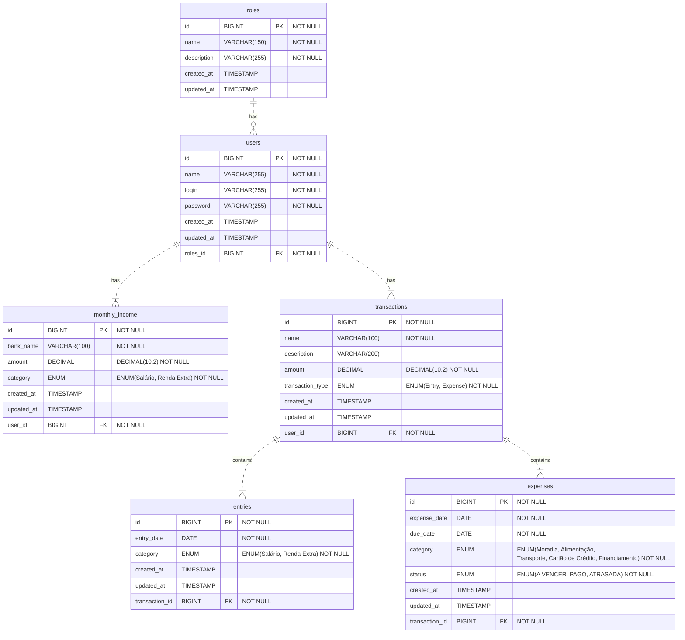

# Diagrama: Modelo de Entidade e Relacionamento

Este diagrama ilustra como o banco de dados do sistema está desenvolvido no presente momento e a cada alteração deverá ser atualizado.

```mermaid
erDiagram
    roles ||..o{ users : has
    roles {
        id BIGINT PK "NOT NULL"
        name VARCHAR(150) "NOT NULL"
        description VARCHAR(255) "NOT NULL"
        created_at TIMESTAMP
        updated_at TIMESTAMP
    }
    users ||..|{ monthly_income : has
    users {
        id BIGINT PK "NOT NULL"
        name VARCHAR(255) "NOT NULL"
        login VARCHAR(255) "NOT NULL"
        password VARCHAR(255) "NOT NULL"
        created_at TIMESTAMP
        updated_at TIMESTAMP
        roles_id BIGINT FK "NOT NULL"
    }
    monthly_income {
        id BIGINT PK "NOT NULL"
        bank_name VARCHAR(100) "NOT NULL"
        amount DECIMAL "DECIMAL(10,2) NOT NULL"
        category ENUM "ENUM(Salário, Renda Extra) NOT NULL"
        created_at TIMESTAMP
        updated_at TIMESTAMP
        user_id BIGINT FK "NOT NULL"
    }
    users ||..|{ transactions : has
    transactions {
        id BIGINT PK "NOT NULL"
        name VARCHAR(100) "NOT NULL"
        description VARCHAR(200)
        amount DECIMAL "DECIMAL(10,2) NOT NULL"
        transaction_type ENUM "ENUM(Entry, Expense) NOT NULL"
        created_at TIMESTAMP
        updated_at TIMESTAMP
        user_id BIGINT FK "NOT NULL"
    }
    transactions ||..|{ entries : contains
    entries {
        id BIGINT PK "NOT NULL"
        entry_date DATE "NOT NULL"
        category ENUM "ENUM(Salário, Renda Extra) NOT NULL"
        created_at TIMESTAMP
        updated_at TIMESTAMP
        transaction_id BIGINT FK "NOT NULL"
    }
    transactions ||..|{ expenses : contains
    expenses {
        id BIGINT PK "NOT NULL"
        expense_date DATE "NOT NULL"
        due_date DATE "NOT NULL"
        category ENUM "ENUM(Moradia, Alimentação, 
Transporte, Cartão de Crédito, Financiamento) NOT NULL"
        status ENUM "ENUM(A VENCER, PAGO, ATRASADA) NOT NULL"
        created_at TIMESTAMP
        updated_at TIMESTAMP
        transaction_id BIGINT FK "NOT NULL"
    }

```
